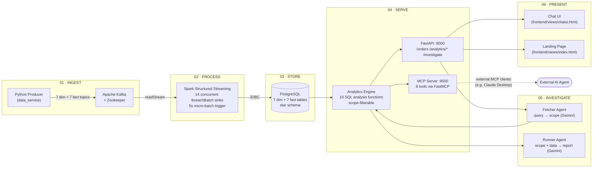
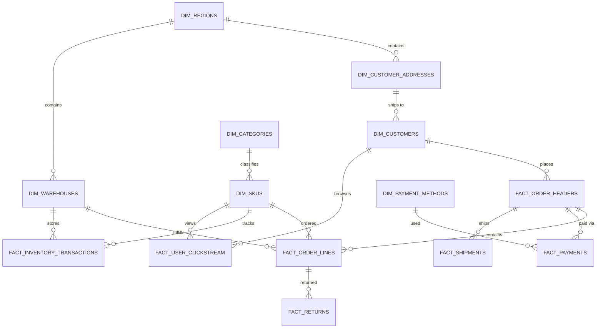

<div align="center">

# EcomIQ

### Real-Time Operational Intelligence for E-Commerce Fulfillment

**Kafka → Spark Structured Streaming → PostgreSQL → FastAPI → Gemini-powered AI agents**

*Ask a question in plain English. Get a root-cause investigation report grounded in live operational data.*

[](#)
[](#)
[](#)
[](#)
[](#)
[](#)
[](#)
[](#)

</div>

---

## The Problem

E-commerce operations run on data that lives in silos — orders, payments, shipments, returns, and inventory sit in separate systems that don't talk to each other. When something breaks — a courier mishandling a category in one region, a payment gateway degrading, a spike in defective-item returns — nobody notices until the damage has compounded for days.

**The cost isn't the failure itself. It's the time between when it starts and when someone finds out.**

## The Solution

EcomIQ streams every operational event — orders, payments, shipments, returns, inventory, and clickstream — into one unified, queryable star schema, then puts a Gemini-powered multi-agent investigation layer on top of it. Instead of exporting CSVs and joining them by hand, you ask:

> *"Why is Delhivery performing poorly in West India?"*

and get back a structured root-cause report, generated from live SQL results — not a hallucinated guess.

---

## Table of Contents

- [Architecture](#architecture)
- [Data Model](#data-model--star-schema)
- [What's Actually Running](#whats-actually-running)
- [Repository Structure](#repository-structure)
- [Getting Started](#getting-started)
- [API Reference](#api-reference)
- [The AI Investigation Layer](#the-ai-investigation-layer)
- [MCP Server — 8 Analytics Tools](#mcp-server--8-analytics-tools)
- [Frontend](#frontend)
- [Case Study](#case-study-tracing-a-regional-courier-failure)
- [Who This Is For](#who-this-is-for)
- [Known Limitations](#known-limitations--next-steps)
- [Tech Stack](#tech-stack)

---

## Architecture



Every stage above is a real, running Docker service — not an intended design.

---

## Data Model — Star Schema

14 tables: 7 conformed dimensions shared across 7 fact tables, so a question spanning region, courier, category, and payment status resolves in a single join — not a cross-system export.



<details>
<summary><strong>Full column reference (click to expand)</strong></summary>

**Dimensions**

| Table | Columns |
|---|---|
| `dim_regions` | `region_id`, `region_name`, `country` |
| `dim_categories` | `category_id`, `category_name` |
| `dim_skus` | `sku_id`, `category_id`, `baseline_price` |
| `dim_customer_addresses` | `address_id`, `city`, `region_id` |
| `dim_customers` | `customer_id`, `address_id`, `registration_date` |
| `dim_warehouses` | `warehouse_id`, `region_id` |
| `dim_payment_methods` | `method_id`, `method_name` |

**Facts**

| Table | Columns |
|---|---|
| `fact_order_headers` | `order_id`, `customer_id`, `total_order_value`, `event_timestamp` |
| `fact_order_lines` | `line_id`, `order_id`, `sku_id`, `warehouse_id`, `quantity`, `line_value` |
| `fact_payments` | `payment_id`, `order_id`, `method_id`, `amount`, `payment_status`, `failure_reason`, `event_timestamp` |
| `fact_shipments` | `shipment_id`, `order_id`, `courier_name`, `event_type`, `event_timestamp` |
| `fact_returns` | `return_id`, `line_id`, `return_reason`, `return_status`, `event_timestamp` |
| `fact_inventory_transactions` | `transaction_id`, `sku_id`, `warehouse_id`, `event_type`, `quantity_change`, `event_timestamp` |
| `fact_user_clickstream` | `event_id`, `customer_id`, `sku_id`, `device_type`, `event_type`, `event_timestamp` |

Full DDL: [`EcomIqDbSchema.sql`](./EcomIqDbSchema.sql)

</details>

---

## What's Actually Running

| Stage | Component | Detail |
|---|---|---|
| **Ingest** | `data_service` | Python producer — seeds 7 dimension topics once, then streams 7 fact-event topics continuously via `kafka-python-ng` |
| **Broker** | `zookeeper` + `kafka` | `confluentinc/cp-kafka:7.5.0` / `cp-zookeeper:7.5.0` |
| **Process** | `spark_service` | Spark Structured Streaming `3.5.1`. 14 concurrent streams, each parsed against an explicit `StructType` schema and flushed via `foreachBatch` — Spark has no native streaming JDBC sink, so every 5-second micro-batch is written with the standard batch JDBC writer |
| **Store** | PostgreSQL | 14-table Kimball-style fact constellation (run separately — see [Getting Started](#getting-started)) |
| **Serve** | `api_service` | FastAPI (`:8000`) + a parallel `FastMCP` server (`:9500`) — both started from the same container by `Dockerfile`'s shell `CMD` |
| **Analyze** | `analytics_engine.py` | 10 SQL analysis functions across 6 domains (payments, orders, shipments, returns, inventory, clickstream), each independently scope-filterable |
| **Investigate** | 3-agent pipeline | `FetcherAgent` (query → scope) → `InvestigationEngine` (scope → SQL) → `RunnerAgent` (SQL → report), all via Gemini |
| **Present** | `frontend/` | A cinematic landing page and a full chat UI, both calling the same FastAPI backend |

---

## Repository Structure

```
Ecom_iq/
├── data_service/                  # Kafka producer
│   ├── generator.py                 # Synthetic event generator (regions, SKUs, couriers, etc.)
│   ├── producer.py
│   ├── main.py
│   └── Dockerfile
│
├── spark_service/                 # Spark Structured Streaming consumer
│   ├── kafka_consumer.py            # 14 concurrent foreachBatch streams
│   └── Dockerfile
│
├── api_service/                   # FastAPI + MCP + AI agents
│   ├── main.py                      # REST endpoints
│   ├── analytics_engine.py          # SQL analysis layer (Database, ScopeFilter, SignalDetector, AnalysisController)
│   ├── mcp_server.py                # FastMCP server — 8 tools, port 9500
│   ├── find_model.py                # Utility: lists available Gemini models
│   ├── agents/
│   │   ├── fetcher_agent.py         # Natural language → scope dict (Gemini)
│   │   ├── runner_agent.py          # Scope + SQL data → markdown report (Gemini)
│   │   └── supervisor_agent.py      # Orchestrates fetcher → engine → runner
│   ├── requirements.txt
│   └── Dockerfile
│
├── frontend/
│   ├── views/
│   │   ├── index.html               # Landing page
│   │   └── chatui.html              # Conversational investigation UI
│   └── js/
│       ├── api.js                   # Calls POST /investigate
│       ├── app.js
│       └── ui.js
│
├── EcomIqDbSchema.sql              # Full 14-table DDL
├── ProblemStatement.md             # Business case + before/after case study
├── docker-compose.yml
├── .env.example
└── instructions.txt                # Operational runbook (startup order, Docker network fixes, etc.)
```

---

## Getting Started

### Prerequisites
- Docker + Docker Compose
- A [Gemini API key](https://aistudio.google.com/app/apikey) (for the AI investigation layer — the pipeline itself runs without it)

### 1. Configure environment

```bash
cp .env.example .env
# Fill in GEMINI_API_KEY and DB_PASSWORD
```

### 2. Create the shared Docker network

`docker-compose.yml` expects an **external** network — this decouples Postgres (run separately) from the rest of the stack:

```bash
docker network create ecom_iq_network
```

### 3. Run PostgreSQL

```bash
docker run -d --name ecommerce_iq_db \
  --network ecom_iq_network \
  -p 5431:5432 \
  -e POSTGRES_PASSWORD=your_db_password_here \
  postgres:latest
```

Then load the schema:

```bash
docker exec -i ecommerce_iq_db psql -U postgres -d postgres < EcomIqDbSchema.sql
```

### 4. Bring up the pipeline

```bash
docker compose up -d --build
```

This starts `zookeeper`, `kafka`, `data_service` (producer), `spark_service` (consumer), and `api_service` (FastAPI + MCP).

### 5. Verify

```bash
curl http://localhost:8000/
curl http://localhost:8000/orders
```

Or watch raw events land on the broker:

```bash
docker exec -it ecom_iq_kafka kafka-console-consumer \
  --bootstrap-server localhost:9092 \
  --topic topic_fact_order_headers --from-beginning
```

### 6. Open the UI

Open `frontend/views/index.html` for the landing page, or `frontend/views/chatui.html` to start asking questions.

> Full operational runbook — including the fix for the classic "container not on the compose network" Docker networking gotcha — is in [`instructions.txt`](./instructions.txt).

---

## API Reference

Base URL: `http://localhost:8000`

| Method | Endpoint | Description |
|---|---|---|
| `GET` | `/` | Health check |
| `GET` | `/orders?limit=20` | Recent rows from `fact_order_headers` (capped at 100) |
| `DELETE` | `/truncate-all` | Wipes all 14 tables — restarts identity, cascades |
| `GET` | `/analytics/full` | Runs every analysis function across all 14 tables, unscoped — pure SQL, no AI |
| `POST` | `/analytics/investigate` | Same as above, filtered by a `scope` dict you supply directly |
| `POST` | `/investigate` | **The AI endpoint.** Natural language in, structured report out |

<details>
<summary><strong>Example: <code>POST /investigate</code></strong></summary>

```bash
curl -X POST http://localhost:8000/investigate \
  -H "Content-Type: application/json" \
  -d '{"query": "Why is Delhivery performing poorly in West India?"}'
```

```json
{
  "query": "Why is Delhivery performing poorly in West India?",
  "scope_extracted": {
    "region": "West India",
    "courier_name": "Delhivery"
  },
  "report": "## 🔍 Investigation Summary\n..."
}
```

</details>

---

## The AI Investigation Layer

Three agents, each with one job:

```
User question
     │
     ▼
┌─────────────────┐   "Why is Delhivery performing        {"region": "West India",
│  Fetcher Agent   │    poorly in West India?"        →     "courier_name": "Delhivery"}
│  (Gemini)        │
└─────────────────┘
     │  scope dict
     ▼
┌─────────────────┐   runs the relevant SQL analysis       payment/order/shipment/return/
│ Investigation    │    functions, filtered by scope   →    inventory/clickstream breakdowns
│ Engine (SQL)     │                                        + anomaly signals
└─────────────────┘
     │  raw analytics JSON
     ▼
┌─────────────────┐   turns SQL results into a
│  Runner Agent    │    structured markdown report     →   final investigation report
│  (Gemini)        │
└─────────────────┘
```

Every report the Runner Agent produces follows a fixed structure — Investigation Summary, Key Findings, Operational Signals, Root Cause Analysis, Operational Impact, Recommended Actions — and is explicitly instructed **not to invent data that isn't in the provided analytics**.

**Recognized scope parameters:** `region`, `city`, `courier_name`, `payment_status`, `payment_method`, `device_type`, `return_reason`, `category`

**Anomaly detection:** any breakdown value more than 1.5× the group average is flagged `MEDIUM`; more than 2× is flagged `HIGH`.

**Resilience:** both Gemini-calling agents fall back across `gemini-flash-latest → gemini-2.0-flash → gemini-3.5-flash` with exponential backoff on `429`/`503`.

---

## MCP Server — 8 Analytics Tools

Independent of the built-in chat UI, `api_service/mcp_server.py` exposes the same analytics engine as **MCP tools** (`FastMCP`, port `9500`) — so any MCP-compatible client (Claude Desktop, another agent framework) can call your live operational data directly.

| Tool | Purpose |
|---|---|
| `run_full_investigation` | Full report, all 14 tables, no filter |
| `run_scoped_investigation(scope)` | Full report, filtered by any scope dict |
| `get_payment_analysis(scope)` | Payment failure rates by method + reason |
| `get_shipment_analysis(scope)` | Courier performance + shipment volume by region |
| `get_order_analysis(scope)` | Order counts + revenue by region and category |
| `get_return_analysis(scope)` | Top returned SKUs + return reason breakdown |
| `get_inventory_analysis(scope)` | Stock movement per warehouse |
| `get_clickstream_analysis(scope)` | Device-type breakdown + event funnel |

---

## Frontend

Two static pages, both talking to the FastAPI backend over `fetch()` — no build step required.

- **`index.html`** — the project's landing page: hero, architecture walkthrough, the 14-table schema, and the courier-failure case study below.
- **`chatui.html`** — a full conversational interface (`marked.js` for markdown rendering) with quick-start prompts like *"Why are payments failing?"* and *"Which SKUs have the most returns?"*, wired straight to `POST /investigate`.

---

## Case Study: Tracing a Regional Courier Failure

**Scenario:** A courier begins mishandling electronics shipments in one region, driving up damaged-goods returns.

| | Before EcomIQ | After EcomIQ |
|---|---|---|
| **Detection method** | Analyst manually exports CSVs from WMS, payment processor, and shipment tracker, then joins them in a spreadsheet by order ID | `POST /investigate` with a plain-English question — or a single SQL join across `fact_returns` → `fact_order_lines` → `fact_shipments` |
| **Time to root cause** | 3–4 hours of manual work, **after** someone first notices | Minutes — bounded by the 5-second Spark micro-batch trigger and query time |
| **Detection lag** | **~5 days** of the courier continuing to ship the same broken way | **Minutes**, not days |
| **Action taken** | Reactive, after losses have compounded | Same-day reroute of that courier for that category |

Full write-up: [`ProblemStatement.md`](./ProblemStatement.md)

---

## Who This Is For

| User | Their blind spot |
|---|---|
| **3PL / Warehouse Operators** | Managing multiple clients' SKUs across regions — need to isolate whether a failure is courier-side, warehouse-side, or product-side |
| **D2C Brands (self-fulfilled)** | Need to catch payment fraud spikes or gateway degradation before losses compound |
| **Marketplace Operators** | Need root-cause tracing across seller, SKU, and region to know who's responsible |

---

## Known Limitations / Next Steps

- **No DB-level constraints yet** — table columns are plain `VARCHAR`/`DOUBLE PRECISION` with no primary or foreign keys. Duplicate rows can occur if the pipeline is restarted mid-checkpoint (this happened once during development and was resolved with a manual `TRUNCATE`, not a schema fix).
- **`MCP_SERVER_URL` env var is defined but not yet consumed internally** — the built-in supervisor pipeline calls Gemini directly rather than routing through the MCP server; the MCP server currently serves *external* clients only.
- **No BI tool connection yet** (e.g. Power BI) — the star schema is designed to support one, but it isn't wired up.
- **Return reasons in the synthetic generator are currently limited to `"damaged"`**, though the scope extractor and analytics engine already support `wrong_item`, `not_needed`, and `size_issue`.

---

## Tech Stack

| Layer | Technology |
|---|---|
| Message broker | Apache Kafka `7.5.0` + Zookeeper |
| Stream processing | Spark Structured Streaming `3.5.1` (`spark-sql-kafka-0-10`) |
| Database | PostgreSQL (star schema, JDBC sink) |
| API | FastAPI + Uvicorn |
| Agent tooling | FastMCP (Model Context Protocol server) |
| AI | Google Gemini (`gemini-flash-latest`, with fallback chain) |
| Producer client | `kafka-python-ng` |
| Frontend | Vanilla HTML/CSS/JS, `marked.js` for markdown rendering |
| Orchestration | Docker Compose |

---

<div align="center">

Built by [**shubhamjoshi32**](https://github.com/shubhamjoshi32)

</div>
